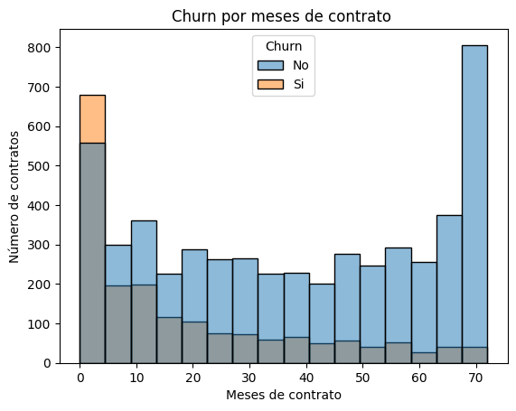
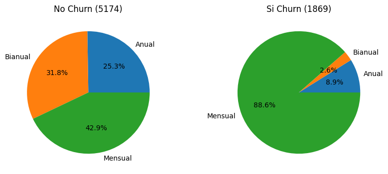
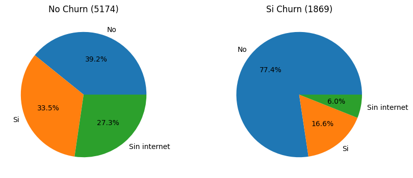

Segundo reto de Alura Latam
Se practica:
- Extracción de datos
- Limpieza de datos
- Transformación de datos
- Visualización
- Análisis de datos

Uso de librerías:
- request
- json
- pandas
- numpy
- seaborn
- matplotlib

Challenge Telecom X Latam
Una empresa desea identificar porque pierde clientes, se realizará un análisis para ayudar al equipo a determinar posibles razones.

📄Informe final
En este informe se presenta de forma sintetizada el resultado del análisis efectuado para identificar razones de abandono de clientes (Churn) los churn negativos indican que siguen siendo nuestros clientes y el positivo significa que nos abandonaron.

Datos que no afectan significativamente el churn:
- El género (hombres y mujeres)
- Una gran cantidad de clientes tienen teléfono y no parece influir en la decisión de dejar la empresa o no.
- No se observan cambios importantes en la decisión por número de líneas telefónicas.

Datos que si tienen diferenca en el churn:

Demográficos
- De nuestros clientes actuales, 12.8% son de la tercera edad, de los que nos han dejado 25.5% son de la tercera edad, así que aumenta la probabilidad de dejarnos.
- Quienes tienen pareja se quedan más (clientes actuales con pareja: 52.8%) , se van más si no tienen pareja(64.2%).
- Si tienen dependientes tienden a quedarse. 84.6% de los clientes que se van no tienen dependientes.

Observaciones: Estos datos sirven para mejorar la segmentación de clientes

Tipo de contrato y formas de pago
- Los clientes que tienen contratos más cortos se van más.
- 88.6% de los clientes que nos dejan, manienen un contrato mensual.
- 74.9% de los clientes que nos dejan, reciben factura electrónica.
- 57.3% de los clientes que nos dejan, pagan con cheque electrónico.

Observaciones:* Las caracteristicas de plazos cortos y facilidades tecnológicas favorecen la salida rápida de clientes, se sugiere aplicar campañas de fidelización

88.6% de los clientes que nos dejan, manienen un contrato mensual.

Situaciones Técnicas
- 69.9% de los clientes que nos dejan, tienen fibra óptica.
- 78.2% de los clientes que nos dejan, no cuentan con seguridad adicional online.
- 66% de los cientes que nos dejan, no tienen respaldo online.
- 64.8% de los clientes que nos dejan, no tienen protección de dispositivo.
- 77.4% de los clientes que nos dejan, no tienen soporte técnico rápido.
- 49.6% de los clientes que nos dejan, no tienen TV por stremming.
- 50.2% de los clientes que nos dejan, no tienen Stremming para películas.

Observaciones:* Atención al área técnica para fidelizar clientes
78.2% de los clientes que nos dejan, no cuentan con seguridad adicional online.
 

77.4% de los clientes que nos dejan, no tienen soporte técnico rápido.

